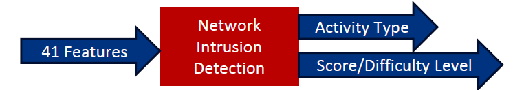

# Spark-for-NSL-KDD

This repository contains the code and output screenshot for preprocessing and running logistic regression classifier on the NSL-KDD Dataset. The training was done in a distributed manner using Spark.

The NSL-KDD dataset is an enhanced dataset to help researchers compare different intrusion detection methods.
The dataset contains 100k+ records and contains 43 features per record, with 41 of the features referring to the traffic input itself and the last two columns represent theactivity type (whether it is normal or attack) andScore/Difficulty level(the severity of the traffic input itself).

In the dataset, there are 4 different classes of attacks:

• Denial of Service (DoS)

• Probe

• User to Root (U2R

• Remote to Local (R2L)

To run the notebook, upload it to a Google Cloud Platform cluster Jupyter instance and run all the cells. The final cell will output the classification accuracy. Additionally, a screenshot is provided showing the output for a previous run. The dataset should be added to the hadoop storage bucket before running the notebook. 
